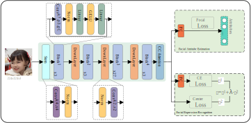

# 基于上下文通道注意力机制的人脸属性估计与表情识别
#（Facial attribute estimation and expression recognition based on contextual channel attention mechanism）



A PyTorch implementation of the [FAER](https://kns.cnki.net/kcms2/article/abstract?v=v5HVlYuqh9qy9Jy50ovh3R_ohTNoNi1Tw2-GgzoZ7z8DdzkZ__gFP4MYpB-sBX-4B9uMnQMOMuFXbwyWaNdzjHNFlDiD6hReqGS5Upt4YNMx6bycOGrmzffSsQ4lXtT_3Nr8wZ-iNNs=&uniplatform=NZKPT&flag=copy).

  

## Training
We provide the training code for AffectNet and RAF-DB.  

For AffectNet、RAF-DB dataset, run:
```
Comming soon
```

For CelebA dataset, run:
```
CUDA_VISIBLE_DEVICES=0,1 python main_celeba.py 
```

## Models
Pre-trained models can be downloaded for evaluation as following:

|     task    	| accuracy 	| link 	|
|:-----------:	|:--------:	|:----:	|
| CelebA       	| 91.87%   	|Comming soon|
| AffectNet 	  | 66.66%    |Comming soon|  
| RAF-DB       	| 91.75%   	|Comming soon|


## Grad CAM++ Reproduction


