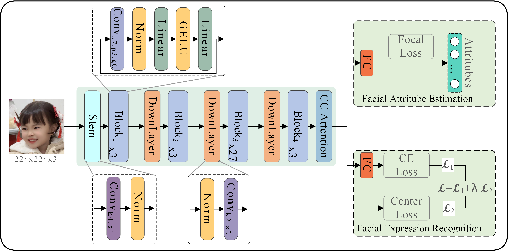
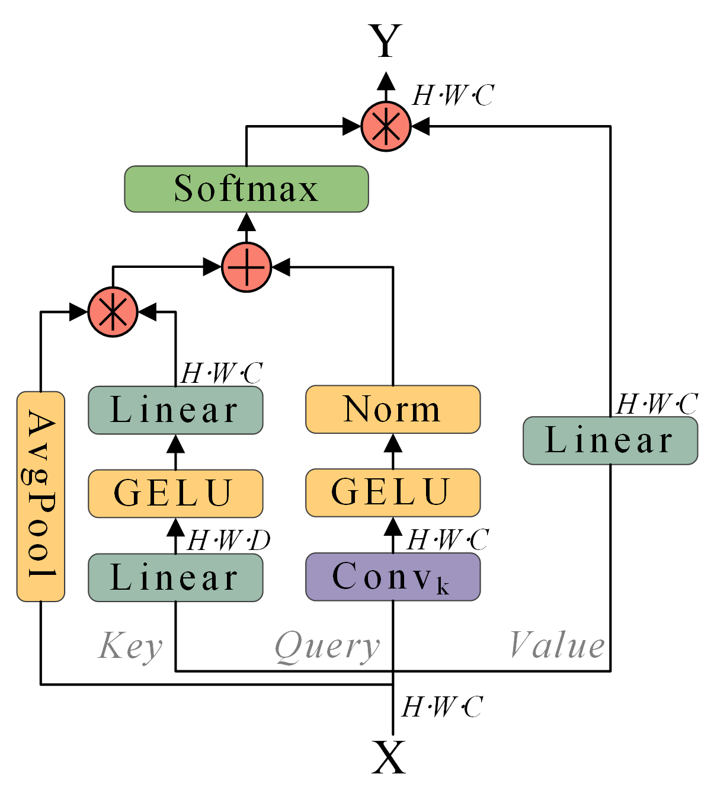
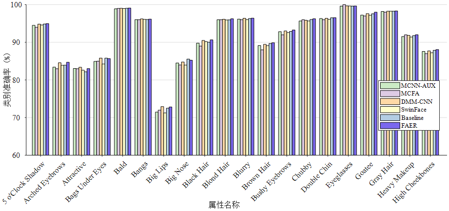
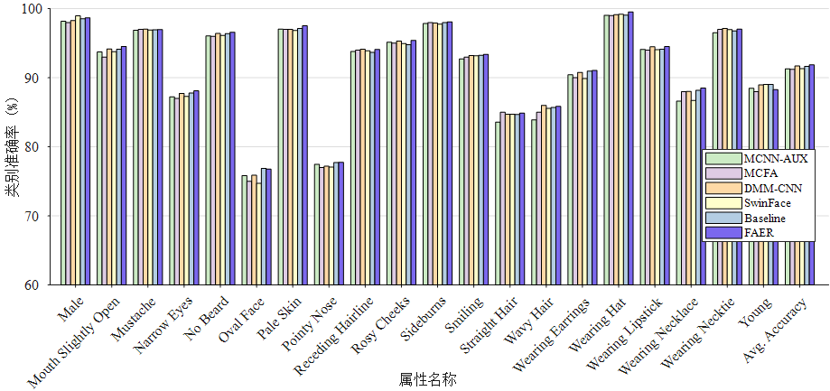

# 基于上下文通道注意力机制的人脸属性估计与表情识别
# （Facial attribute estimation and expression recognition based on contextual channel attention mechanism）

<div align=center>
Grad-CAM for MFER on RAF-DB dataset
</div>
<div align=center>



Fig. 1 Architecture of proposed FAER
</div>

A PyTorch implementation of the [FAER](https://kns.cnki.net/kcms2/article/abstract?v=v5HVlYuqh9qy9Jy50ovh3R_ohTNoNi1Tw2-GgzoZ7z8DdzkZ__gFP4MYpB-sBX-4B9uMnQMOMuFXbwyWaNdzjHNFlDiD6hReqGS5Upt4YNMx6bycOGrmzffSsQ4lXtT_3Nr8wZ-iNNs=&uniplatform=NZKPT&flag=copy).

## Proposed Contextual Channel Attention mechanism
<div align=center>



Fig. 2 Architecture of Contextual Channel Attention
</div>


## 1、Preparation
- Download pre-trained model of [MSCeleb](https://drive.google.com/file/d/1H421M8mosIVt8KsEWQ1UuYMkQS8X1prf/view?usp=sharing).
- Download [RAF-DB](http://www.whdeng.cn/raf/model1.html) dataset and extract to `./datasets` dir.
- Download [AffectNet](http://mohammadmahoor.com/affectnet/) dadtaset and extract the to `./datasets` dir.


## Note:
The code for FaceExpression and FaceAttribute are similar, except for the Loss Function and the Type of label the model predicts.


## Training
We provide the training code for CelebA, AffectNet and RAF-DB.  

For AffectNet、RAF-DB dataset, run:
```
Comming soon
```

For CelebA dataset, run:
```
CUDA_VISIBLE_DEVICES=0,1 python main_celeba.py 
```

## Models
Pre-trained models can be downloaded for evaluation as following:

|     task    	| accuracy 	| link 	|
|:-----------:	|:------------:	|:------------:	|
| `CelebA`     	| `91.87%` 	    |`Comming soon`  |
| `AffectNet` 	| `66.66%`      |`Comming soon`  |  
| `RAF-DB`     	| `91.75%` 	    |`Comming soon`  |


## Class-wise accuracy and avg. accuracy of CelebA
<div align=center>



Fig. 4(a) Class-wise accuracy of FAER on CelebA[0:20]
</div>


<div align=center>



Fig. 4(b) Class-wise accuracy of FAER on CelebA[21:41]
</div>


## Grad CAM Reproduction
<div align=center>
Grad-CAM for FAER on CelebA dataset
</div>
<div align=center>


Fig. 5 Grad-CAM visualization on CelebA dataset
</div>


<div align=center>
Grad-CAM for FAER on AffectNet dataset
</div>
<div align=center>


Fig. 5 Grad-CAM visualization on AffectNet dataset
</div>

## For more detail imformation, see:
[基于上下文通道注意力机制的人脸属性估计与表情识别](./set/基于上下文通道注意力机制的人脸属性估计与表情识别_徐杰.pdf)
